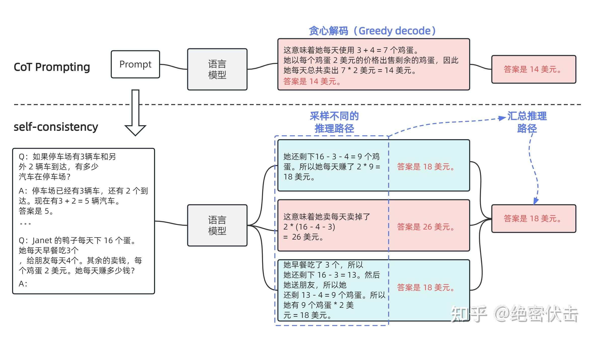
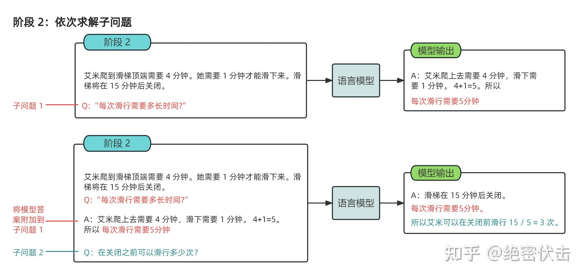
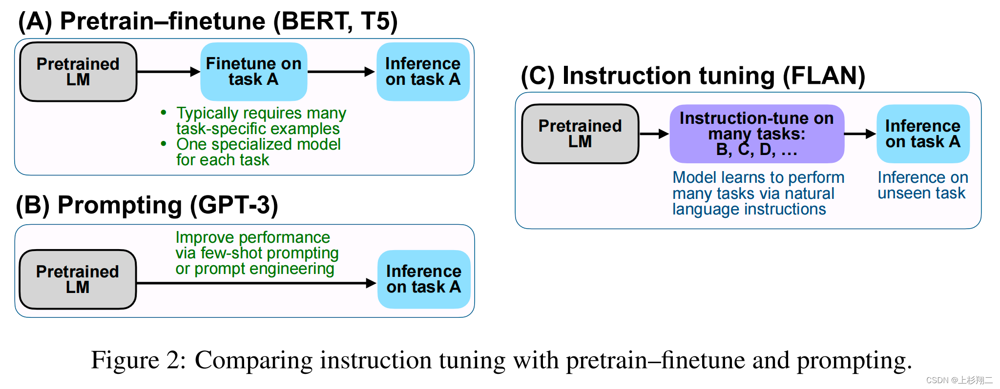
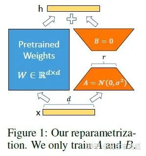
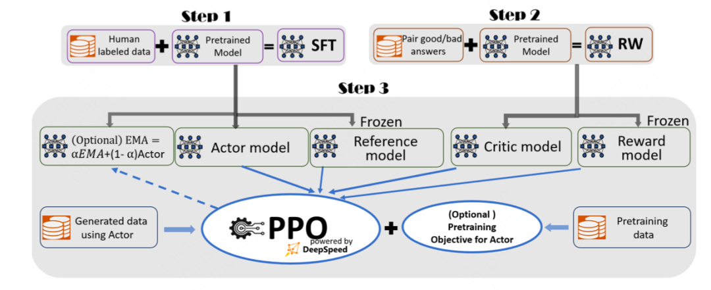
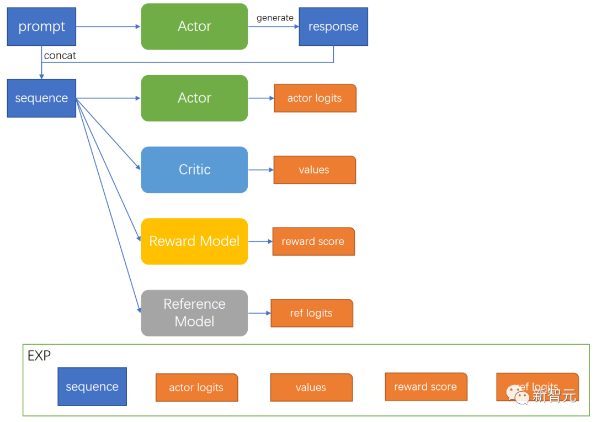
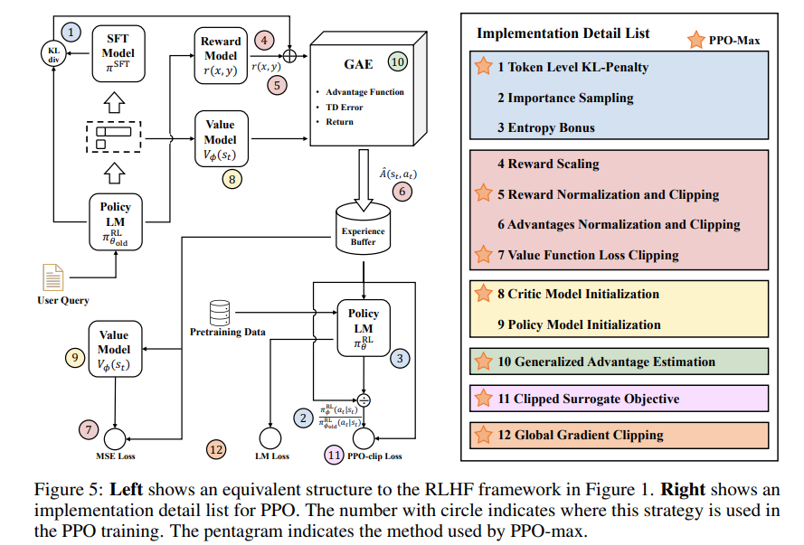

# LLM基础知识

| Top-k抽样 | 模型从最可能的"k"个选项中随机选择一个 | 如果k=10，模型将从最可能的10个单词中选择一个 |
| --- | --- | --- |
| Top-p抽样 | 模型从累计概率大于或等于“p”的最小集合中随机选择一个 | 如果p=0.9，选择的单词集将是概率累计到0.9的那部分 |
| Temperature | 控制生成文本随机性的参数。较高的温度值会产生更随机的输出，而较低的温度值则会使模型更倾向于选择最可能的单词 | 较高的温度值，如1.0，会产生更随机的输出，而较低的温度值，如0.1，会使模型更倾向于选择最可能的单词 |

- **FLOPS"和"FLOPs**
    
    1. **FLOPS (Floating Point Operations Per Second):**
        - FLOPS是计量计算机或计算设备每秒能够执行的浮点运算次数的单位。这是衡量计算性能的一种指标，尤其在科学计算、模拟和其他需要大量浮点运算的领域非常重要。
        - 例如，1 GFLOPS表示每秒执行十亿次浮点运算。这可以包括加法、减法、乘法和除法等操作。
    2. **FLOPs (Floating Point Operations):**
        - FLOPs是指浮点运算，是计算机进行的浮点数运算的基本操作。它不是速度的单位，而是表示计算的数量。
        - 当谈论一个算法或程序的性能时，可以使用FLOPs来描述它执行的浮点运算的数量，而不考虑执行所需的时间。这是一个更抽象的概念，不同的架构和实现可能在相同数量的FLOPs下具有不同的性能。
    
    **计算FLOPS：**
    计算FLOPS的方法是通过测量在一秒钟内执行的浮点运算数量。通常，这涉及到测量特定任务或应用程序的执行时间，然后使用以下公式计算：
    
    $\text{FLOPS} = \frac{\text{总浮点运算数}}{\text{执行时间}}$
    
    其中，“总浮点运算数”是算法或应用程序在执行过程中实际执行的浮点运算数量。
    
    需要注意的是，FLOPS的计算结果可能受到硬件架构、编译器优化和其他因素的影响，因此它通常用作相对性能的指标而非绝对性能。
    
- **有哪些tokenizer的方式**
    - word-level
    - char-level
    - subword-level:**尽量不分解常用词，而是将不常用词分解为常用的子词**，“annoyingly”可能被认为是一个罕见的单词，并且可以分解为“annoying”和“ly”。“annoying”并“ly”作为独立的子词会更频繁地出现。
      
        subword的分词往往包含了两个阶段,一个是 encode 阶段,形成 subword的vocabulary dict,一个是 decode 阶段,将原始的文本通过 subword 的vocabulary dict 转化为 token的 index 然后进入embedding层.
        
    
    subword-level 最为常用，Llama的tokenizer是**BPE**。**BPE每一步都将最常见的一对*相邻数据单位*替换为该数据中没有出现过的一个*新单位* ，反复迭代直到满足停止条件。**
    
    合并字符可以让你**用最少的token来表示语料库**，这也是 BPE 算法的主要目标，即**数据的压缩**。在每个单词的末尾添加“</w>”标记以标识单词边界能够让算法知道**每个单词的结束位置**（因为我们统计相邻字符对时不能把**分别位于两个单词**中的字符对算进去），这有助于算法查看每个字符并找到频率最高的字符配对。“</w>”也能被算作字符对的一部分。
    
- **遇到OOV（Out Of Vocabulary）怎么做?**
  
    也就是词汇表外的词。在NLP中，通常会预先构建一个词汇表，包含所有模型能够识别的词。然而，总会有一些词没有出现在预先构建的词汇表中，这些词就是 OOV。传统的处理方式往往是将这些 OOV 映射到一个特殊的符号，如 UnKnow，但这种方式无法充分利用 OOV 中的信息。例如，对于词汇表中没有的词 "unhappiness"，如果直接映射为UnKnow ，则模型就无法理解它的含义。
    
    WordPiece/Byte Pair Encoding (BPE) 等基于子词的分词方法提供了一种解决 OOV 问题的方式。现在更多的语言大模型选择基于BPE的方式，只不过BERT时代更多还是WordPiece。BPE 通过将词分解为更小的单元（子词或字符），可以有效地处理词汇表外的词。对于上面的 "unhappiness" 例子，即使 "unhappiness" 本身不在词汇表中，但是它可以被分解为 "un"、"happiness" 等子词，而这些子词可能在词汇表中。这样，模型就可以通过这些子词来理解 "unhappiness" 的含义。另一方面就是，BPE本身的语义粒度也很合适，一个token不会太大，也不会小到损失连接信息（如一个字母）。
    
- **zeroshot和Fewshot具体做法的区别？**
  
    Zeroshot和Fewshot是两种在自然语言处理任务中处理未见过的类别或样本的方法，它们有以下具体做法上的区别：
    
    1. Zeroshot（零样本学习）：
        - Zeroshot方法旨在处理完全未见过的类别或样本。在训练阶段，模型接收到类别和样本的描述信息，但没有直接观察到这些类别或样本的实例。然后，模型通过学习从已见过的类别中抽取的一般化知识来进行预测。
        - 一种常见的Zeroshot方法是使用外部知识库或语义表示来表示类别和样本，例如使用WordNet、知识图谱或预训练的词向量。模型可以通过将问题或样本与这些表示进行匹配来进行预测。
    2. Fewshot（少样本学习）：
        - Fewshot方法旨在处理只有少量样本的类别。在训练阶段，模型只接收到少量样本和对应的类别标签。这些样本可以是从已见过的类别中随机选择的，或者是通过一些特定的采样策略选择的。模型需要从这些少量样本中学习一般化的表示和模式，以便在测试阶段处理未见过的类别。
        - Fewshot方法通常使用元学习（meta-learning）的思想，通过在少量样本的任务上进行多个迭代的训练，使模型能够快速适应新的类别。元学习算法可以帮助模型学习到一般化的优化策略，以在少样本任务上获得较好的性能。
- **在指令微调中，如何设置、选择和优化不同的超参数，以及其对模型效果的影响？**
    - 数据集
    - drop-last
    - 模型本身
    - 训练设置
    - batch_size
    - clip grad
    - lr rate
    - weight decay
    - loss scale
    - warm up iters
    - lr decay style
    - lr decay iters
- **思维链 CoT（Chain-of-Thought）相关**
    1. **CoT** 提示过程是一种最近开发的提示方法，它鼓励大语言模型解释其推理过程。思维链的主要思想是通过向大语言模型展示一些少量的 exapmles，在样例中解释推理过程，大语言模型在回答提示时也会显示推理过程。这种推理的解释往往会引导出更准确的结果。
       
        
        
        
        
        CoT 在实现上修改了 demonstration 每个 example 的 target，source 保留原样，但 target 从原先的 answer(a) 换成了 rationale(r) + a。因此可以看到右侧，所有内容均由模型生成，模型不是生成 a，而是生成 r+a。
        
        简单来说，语言模型很难将所有的语义直接转化为一个方程，因为这是一个更加复杂的思考过程，但可以通过中间步骤，来更好地推理问题的每个部分。思维链提示，就是把一个多步骤推理问题，分解成很多个中间步骤，分配给更多的计算量，生成更多的 token，再把这些答案拼接在一起进行求解。
        
    2. **自洽性（Self-consistency**），是对 CoT 的一个补充，它不仅仅生成一个思路链，而是生成多个思路链，然后取多数答案作为最终答案。
       
        在下面的图中，左侧的提示是使用少样本思维链范例编写的。使用这个提示，独立生成多个思维链，从每个思维链中提取答案，通过“边缘化推理路径”来计算最终答案。实际上，这意味着取多数答案。
        
        
        
    3. **LtM （Least to Most prompting）提示**
       
        最少到最多提示过程 (Least to Most prompting, LtM) 将思维链提示过程 (CoT prompting) 进一步发展，首先将问题分解为子问题，然后逐个解决。它是受到针对儿童的现实教育策略的启发而发展出的一种技术。
        
        与思维链提示过程类似，需要解决的问题被分解成一组建立在彼此之上的子问题。在第二步中，这些子问题被逐个解决。**与思维链不同的是，先前子问题的解决方案被输入到提示中，以尝试解决下一个问题**。
        
        简单来说就是一步一步来，step by step。单纯的 CoT 不足以解决复杂问题，但是我们可以把它分解成一个个小问题，然后再使用 CoT，这样模型就能把问题求解出来。所以从这个角度看，Least-to-Most 和 CoT 不是选择关系，而是可以互相打配合的。
        
        
        
        
        
    
    可以看到，在Chain-of-thought训练中，将数据集中的输入分解为一系列任务是非常关键的一步。一般来说，这个过程需要根据特定的任务和数据集来进行定制。以下是一些通用的方法：
    
    1. 首先，需要定义一个目标任务，即要求模型完成的最终任务。例如，如果目标任务是自然语言生成，那么数据集中的输入可能是一句话或一个段落，模型需要将其转化为自然语言响应。
    2. 然后，需要将目标任务分解为一系列子任务。这些子任务应该是相互关联的，每个子任务的输出都可以作为下一个子任务的输入。例如，在自然语言生成任务中，可以将其分解为理解输入的语义、确定输出的语法结构、生成文本等子任务。
    3. 每个子任务的输入和输出都需要定义。例如，在自然语言生成任务中，输入可能是一组与上下文相关的单词，输出可能是下一个单词或整个句子。
    4. 每个子任务都需要为其定义一个训练目标和相应的损失函数。这些目标和损失函数应该与任务相关，并帮助模型学习与该任务相关的知识。
    5. 最后，需要将所有子任务组合起来，构建一个完整的模型。每个子任务的输出都将成为下一个子任务的输入，直到完成目标任务。
- **解释P-tuning 的工作原理，并说明它与传统的 fine-tuning方法的不同之处。**
  
    传统的fine-tuning方法通常是在一个预训练的模型上进行微调，将模型的参数调整到特定任务的需求上。这种方法需要大量的标注数据来训练模型，因为模型的参数是通过在标注数据上进行优化得到的。
    
    而P-tuning是一种零样本学习的方法，它可以在没有标注数据的情况下进行任务学习。P-tuning通过在预训练模型中添加一个prompt模板，将任务的描述信息作为输入，然后通过对输入进行修改来生成特定任务的输入样本。这样就可以在没有标注数据的情况下进行任务学习。
    
    P-tuning的关键是prompt模板的设计，它需要能够引导模型生成与任务相关的输入样本。通过设计合适的prompt模板，P-tuning可以在没有标注数据的情况下进行零样本学习。
    
    prompt-learning本质上其实也是一种微调，但是它和之前的finetuning有些许不同。
    
    - 冻结了预训练模型的权重，减少了训练的内存和时间。
    - 只用0.1%左右的任务特定参数（prompt）训练，获得了与finetuning相匹配的性能。
    - 通过prompt-learning提示学习，使微调的过程与预训练的过程上下游一致，没有破坏预训练的训练方式，有效利用预训练的信息。
- **P-tuning v2**
  
    该方法在每一层都加入了Prompts tokens作为输入，而不是仅仅加在输入层，这带来两个方面的好处：
    
    - 更多可学习的参数（从P-tuning和Prompt Tuning的0.01%增加到0.1%-3%）；同时，也足够参数高效。
    - 加入到更深层结构中的Prompt能给模型预测带来更直接的影响。
- **Prompt-Tuning**
  
    与输出相关的tokens组成的上下文信息即可理解为是一个prompt。Prompt通常是一种短文本字符串，用于指导语言模型生成响应。Prompt提供上下文和任务相关信息，以帮助模型更好地理解要求，并生成正确的输出。例如，在问答任务中，prompt可能包含问题或话题的描述，以帮助模型生成正确的答案。Prompt通常是人类设计的，以帮助模型更好地理解特定任务或领域。
    
    简单总结就是说Prompt就是利用语言模型的生成能力帮我们完成任务。而Prompt-tuning的目的就是设计更加精巧的prompt，然后让模型输出我们想要的内容。
    
    以句子的情感分类为例，基于prompt方式让模型做情感分类任务的做法通常是在句子前面加入前缀“该句子的情感是”即可。
    
    本质上BERT这样的模型是一种生成模型，是无法完成特定任务的。它只是一个提取文本特征的通用模型。
    
    当你在句子前加入“该句子的情感是”这样的前缀，你实际上是将情感分类任务转换为一个“填空”任务。这是因为，在训练过程中，BERT可以学习到这个前缀与句子情感之间的关联。例如，它可以学习到“该句子的情感是积极的”和“该句子的情感是消极的”之间的差异。
    
- **Instruction-Tuning介绍**
  
    Instruction通常是一种更详细的文本，用于指导模型执行特定操作或完成任务。Instruction可以是计算机程序或脚本，也可以是人类编写的指导性文本。Instruction的目的是告诉模型如何处理数据或执行某个操作，而不是简单地提供上下文或任务相关信息。
    
    因此，Prompt和Instruction都是用于指导模型生成输出的文本，但它们的目的和使用方式是不同的。Prompt更多地用于帮助模型理解任务和上下文，而Instruction则更多地用于指导模型执行具体操作或完成任务。
    
    
    
- **在指令微调中，如何选择最佳的指令策略，以及其对模型效果的影响？**
  
    你需要先明确自己需要向什么方面微调：是一个更对齐人类价值观的gossip bot？还是更具备解决问题能力的helper？是更健谈并回答内容更丰富？还是人狠话不多？是单领域？还是多领域？
    
    a.数据需要什么样的？b.该如何组织数据集来微调？
    
    - 更多样的任务-使用不同的提示模板
    - 混合few-shot和zero-shot learning
    - 考虑输入反转
    - 加入CoT
    - 任务混合权重按照经验考虑即可
- **llama, glm，bloom等现有大模型的数据处理，训练细节，以及不足之处模型架构的优化点，包括但不限于attention, norm, embedding.**
  
    LLama2 详情参考：
    
    [Llama 2详解](https://zhuanlan.zhihu.com/p/649756898)
    
- **解决显存不够的方法有哪些？**
  
    
    
    ---
    
    首先如果是只做 **推理**  推理中显存主要被parms占用。就parms而言，对于float32的数据类型，大致估算的话就是每1B的参数需要4G的显存。float16/int8/int4对应除以2即可。
    
    除了存储模型权重所需的内存外，实际前向传递过程中还有一小部分额外的开销。根据经验，这种开销小于等于20%
    
    ---
    
    - **处理模型参数 params**
        - 模型压缩
          
            可以看下OpenBMB的BMCook，具体来说就是在保持性能的前提下把大模型压缩成小模型，比如CPM-Bee在10B的版本上基于BMCook可以压缩成1B/3B/5B的版本。方法有量化、蒸馏、剪枝、Moefication。
            
        - Memory Offload
          
            部分显存挪去内存，只是内存确实跑不动
            
        - 并行
          
            然后如果是 **微调** 的话，考虑的就很多了。微调中显存的占用除了在推理中提到的params，此外还有 forward activations, gradients, 以及optimizer的state.
            
        
        模型可以使用纯fp32或fp16进行训练。除了推理中讨论的常见模型权重数据类型，训练可以引入混合精度训练，例如AMP（Automatic Mixed Precision）。这种技术旨在在保持收敛性的同时最大化GPU张量核心的吞吐量。
        
        现代深度学习训练中经常使用混合精度训练的原因是：
        
        - fp32训练是稳定的，但内存开销较大(avtivations和gradients)，不能充分利用NVIDIA GPU的tensor cores.
        - fp16训练是稳定的，但（可能）很难收敛
        - 混合精度训练需要在内存中存储模型的fp16/bf16和fp32版本，因此需要：Mixed-precision (fp16/bf16 and fp32)，加上一份放在optimizer state中的fp32的拷贝。
        
        
        
    - **处理优化器 optimizer state**
      
        如果开了混合精度训练占用内存计算如下（未开的话去掉第一项）：
        
        - For vanilla AdamW：
            - fp32 copy of parameters:
            - Momentum:
            - Variance:
        - For 8-bit optimizers like bitsandbytes：
            - fp32 copy of parameters:
            - Momentum:
            - Variance:
        - For SGD-like optimizers with momentum：
            - fp32 copy of parameters:
            - Momentum:
    - **处理梯度 gradients**
      
        可以存储为fp32/fp16/bf16（注意，梯度的数据类型通常与模型的数据类型相匹配。因此在fp16混合精度训练中，通常以fp16存储）。
        
    - **处理激活值 activations**
      
        现代GPU在进行LLM的训练时，通常遇到的瓶颈是显存，而不是FLOPs。因此，activation recomputation/checkpointing或者叫gradient checkpointing就变得很重要。它通过牺牲额外的计算成本来减少内存成本。其工作原理是反传算梯度的时候重新计算某些层的activations (输出值)，而不是将它们存储在显存中。显存减少的程度取决于选择哪些层做checkpointing。
        
        这一部分要减少显存，有以下方法：
        
        - a. 分布式训练&张量共享 考虑到是讨论节省内存，所以主要讨论FSDP。
        - b.gradient checkpointing
        - c.PEFT(Parameter Efficient Tuning) 也就是Delta-Tuning，这一部分也可以写一篇不短的综述出来了，我在这里也大概总结一下：
        - d.仍然是各种Offloading 比如说你的优化器可以用AdamOffload等等
        - e.混合精度训练 同样也是量化
        - f.QLoRA 强推，基本上单卡玩这个就足够了，前一阵实现了CPM-Bee 10B模型的QLoRA适配，在单卡3090上就可以十分轻松地完成微调，而且loss降得很舒服。
        - g.optimizer的选择 前面讲过了，不同的optimizer占用显存也不同，比如可以选offloading的，或者选SGD：比如邱锡鹏团队也提出了LOw-Memory Optimization（LOMO），其中在做了一些蛮有趣的设定的前提下，搞了很省的全参数微调的方法论，8块3090全参数微调了Llama65B，就很夸张。
        - h.减少批大小 很直观的方法 i.梯度累积与微批 梯度累积是一种在训练过程中虚拟增加批大小的方法，当可用的 GPU 内存不足以容纳所需的批量大小时，这是非常有用的。并且这种方法只会在运行时产生影响，建模性能并不会受到影响。梯度累积中，每批计算的量较小，并在多次迭代中累积梯度（通常求和或求平均），而不是在每个批次之后立刻更新模型权重。一旦累积的梯度达到目标「虚拟」批大小，模型权重就会用累积的梯度更新。
- **介绍一下Prefix-tuning的思想和应用场景，以及它如何解决一些NLP任务中的挑战**
  
    Prefix Tuning的方法也有很多种，这里我们选取Li&Liang,2021这一篇进行简述。在这篇中，作者通过对输入数据增加前缀（prefix）来做微调。**当然，prefix也可以不止加载输入层，还可以加在Transformer Layer输出的中间层**，感兴趣的朋友可以查找论文自行研究。
    
    如图所示，对于**GPT这样的生成式模型**，在输入序列的最前面加入prefix token，图例中加入2个prefix token，在实际应用中，prefix token的个数是个超参，可以根据模型实际微调效果进行调整。对于**BART这样的Encoder-Decoder架构模型**，则在x和y的前面同时添加prefix token。**在后续微调中，我们只需要冻住模型其余部分，单独训练prefix token相关的参数即可，每个下游任务都可以单独训练一套prefix token。**
    
    **那么prefix的含义是什么呢？prefix的作用是引导模型提取x相关的信息，进而更好地生成y。例如，我们要做一个summarization**的任务，那么经过微调后，prefix就能领悟到当前要做的是个“总结形式”的任务，然后引导模型去x中提炼关键信息；如果我们要做一个**情感分类**的任务，prefix就能引导模型去提炼出x中和情感相关的语义信息，以此类推。这样的解释可能不那么严谨，但大家可以大致体会一下prefix的作用。
    
    Prefix Tuning虽然看起来方便，但也存在以下两个显著劣势；
    
    - 较难训练，且模型的效果并不严格随prefix参数量的增加而上升，这点在原始论文中也有指出
    - 会使得输入层有效信息长度减少。为了节省计算量和显存，我们一般会固定输入数据长度。增加了prefix之后，留给原始文字数据的空间就少了，因此可能会降低原始文字中prompt的表达能力。
- **Lora的原理**
  
    
    
    lora：Low-Rank Adaptation 具体来说，就是考虑到语言模型（LLM尤其如此）的参数的低秩属性（low intrinsic dimension），或者说过参数化，在做finetune的时候不做full-finetune，而是用一个降维矩阵A和一个升维矩阵B去做finetune。
    
    如果我们认为原来的模型的某个参数矩阵为，那么可以认为原来经过全微调的参数矩阵为，但考虑到前面的低秩属性，在lora中我们可以简单认为，其中 的秩相当于是你认为的模型实际的秩。这样的话在做推理的时候，根本不会引入推理延迟，因为你只需要把训好的parms 加进 的params就可以了。在Transformer中self-attention和mlp模块都有对应的params矩阵，对应加上lora即可。
    
    总的来说，这样就很好地把微调参数和原模型参数进行了解耦，因此甚至一些基于lora微调的模型只需要公布lora参数即可（大概就几M）。
    
- **LoRA 微调为什么能降低显存？**
  
    LoRA 微调（LoRA fine-tuning）是指对预训练的语言模型（如 GPT）进行微小调整，以适应特定任务或领域的需求。
    
    相比于从头训练一个全新的模型，LoRA 微调可以显著降低显存（GPU 内存）的需求，这是由于以下几个原因：
    
    1. 数据集规模：在微调过程中，我们通常使用较小的数据集，这个数据集通常比预训练语言模型的训练数据集小得多。较小的数据集意味着在每个批次中处理的样本数量更少，从而减少了显存的需求。
    2. 训练参数：微调过程中，我们通常只对预训练模型的一部分参数进行微调，而不是对所有参数进行训练。这样可以减少需要存储和处理的参数数量，从而减少了显存的占用。
    3. 前向传播和反向传播：微调过程中，每个批次的前向传播和反向传播所需的显存量通常较小。这是因为微调数据集通常较小，每个批次中的样本数量较少，从而减少了计算图中的节点数量，减少了显存的需求。
    4. 因为Lora不需要保存并更新原始模型的optimizer.
    5. LoRA虽然会导致某一层的峰值显存高于全量微调，但计算完梯度后，这个中间结果就可以被清掉了，不会一直保存。
    6. 当待训练权重从`d*d`降为`2*r*d`时，需要保存的optimizer states也减少了（那可是fp32）。
- **Lora 存在的缺点**
    - a.基于低秩的微调可能并不always work，比如finetune与pretrain的gap过大的时候，比如中英差异。当然，这一点在LLM时代可能并不突出，我们认为LLM在预训练阶段已经get了所有基本的知识，finetune只是格式微调，因此可能不会有上述gap过大的情况。
    - b.用lora也需要设置r和target module等，这部分超参的设置需要考虑
- **qLora 原理，与 Lora 的区别是什么？**
  
    在使用QLoRA微调技术时，首先将预训练模型量化为int4格式，然后添加一组可学习的低秩适配器权重。
    
    总的来说QLoRA 使用一种低精度的存储数据类型（NF4）来压缩预训练的语言模型。通过冻结 LM 参数，将相对少量的可训练参数以 Low-Rank Adapters 的形式添加到模型中，LoRA 层是在训练期间更新的唯一参数，使得模型体量大幅压缩同时推理效果几乎没有受到影响。从QLoRA的名字可以看出，QLoRA实际上是Quantize+LoRA技术。
    
- **bf16，fp16 的区别**
  
    其中一位符号位，bf16 用 8bit 表示指数，7bit 表示小数；fp16用5bit 表示指数，10bit 表示小数。也就是说bf16 可表示的整数范围更广泛，但是精度较低；fp16 表示整数范围较小，但是精度较高。
    
    事实上，bf16就是google brain team为了深度学习而设计的数据类型，因为在深度学习中，我们更关心范围，而不是精度（这也是为什么量化很火），因为过参数本身就可以一定程度上弥补精度的损失。
    
    因此，尽管BF16的精度较低，但是它的表示范围较大，因此在深度学习中通常是更好的选择。此外，也是由于精度没有那么高，BF16在操作时需要的硬件资源也会较少。当然，bf16在一些较老的显卡上可能并不支持，不过一般的建议是能适应bf16就使用bf16。
    
- **半精度训练和混合精度训练的的优缺点**
    - 半精度训练：
        - 半精度训练**优点**：很直接的优势，就是跑得快+省显存。
        - 半精度训练**缺点**：当然还是精度（下溢+舍入误差）的问题。
    - 混合精度训练：
      
        idea：同时有低精度和高精度的权重（现在讨论的是float16和float32），前向传播用低精度来算，反向传播的gradients也用低精度来算，但是在更新参数的时候更新的是高精度的参数。然后在下一次的前向传播之前，对这个更新后的高精度参数量化为低精度参数，再开启下一次前向传播。
        
        为什么要这么做呢，其中用到下面几个技术：
        
        - FP32 权重备份：字面意思，对权重备份一份float32版本的版本，在梯度更新的时候避免float16精度不够而发生舍入误差导致的无效梯度更新，但是这样会占用额外的权重的内存，不过这些显存在一些情况下并不致命也就是了。
        - loss scale：由于下溢的问题，也就是训练后期，梯度会很小，float16 容易产生 underflow，所以可以对loss做scale操作，毕竟loss的scale也会作用在梯度上（链式法则），这样一个大的scale比每个梯度都scale下要划算很多。
    - 混合精度训练的优势是否能继承半精度训练的优势？可以！
        - 在显存方面，额外存了一份params的float32版本，但是forward activations都是float16的，实际上这些才是大头，所以还是有显著的显存节省的。在训练推理速度方面，实际上不会更慢，虽然不同数据类型要对齐，但是计算平台会有优化，也就是有专门的硬件加速计算，所以反而会快（仅限于大batch下，因为小batch下的计算速度瓶颈本来在IO，引入混合精度训练可能变成新瓶颈） 这样的话，训练完后推理的时候就用float16就可以了，也就是节省了推理时候前向传播的显存占用和推理时间。
        - 另外就是，layer norm的层可能会完全使用float32，因为需要计算一组值的均值和方差，而这需要进行加法和除法运算，所以float16可能会出岔子。
        - 不过针对还要保存一份float32参数这很不舒服的一点，我们题外话一下就是，你完全可以用QLoRA，也就是量化线性层+lora，反正线性层不会更新参数，我只用它进行前向传播，因此也不用存一份额外的参数；而lora的部分可以采用float16精度来训练，这一部分就算额外保存参数也不会占用很多显存。这样的话相当于把量化+lora的各自优点都拿出来。
        
        
    
- **如何增加context length 模型训练中节约显存的技巧。**
  
    **压缩 prompt，** 
    
    首先考虑经典的**论文问答任务**。prompt一般会包含问题和背景文章。而我们可以想象，对于LLMs来说，**背景文章中包含了许多的冗余内容**：比如对论文背景的介绍，对论文相关工作的介绍等。
    
    这些内容往往是为了照顾不了解背景的读者而添加，**不过由于LLMs在训练的过程中很大概率已经见到过类似内容的文本，所以这些内容并没有带来新的信息**。
    
- **RLHF完整训练过程是什么？RL过程中涉及到几个模型？显存占用关系和SFT有什么区别？**
  
    
    
    RLHF基于A2C方法，这一步包含了四个模型:
    
    - Actor Model：由SFT之后的模型初始化而来。作为策略（policy）模型，用于接收上文，做出动作，预测下一个字符。学习完毕之后，我们最终使用的就是这个模型。
    - Reference Model：和Actor Model同样初始化自SFT Model，训练过程中冻结参数，用于和Actor Model做对比，保证模型不要偏离原始SFT Model太多。
    - Reward Model：作为环境（env），训练过程中冻结参数，针对每一个状态，给出奖励分数。
    - Critic Model：由Reward Model初始化而来，用于近似价值函数，输入为状态s，估计当前状态的价值V。
    
    **训练过程**
    
    接下来梳理一遍训练过程。训练过程整体分为两步：maker experience 和 learn。
    
    首先是make_experience，首先在训练数据中抽取一部分query，然后Actor Model生成答案。然后我们依据这条答案获取我们所需要的经验：
    
    - actor_logits:由Actor Model产生，包含对答案所有词的概率分布。
    - reference_logits：由Reference Model产生，包含对答案所有词语的概率分布，用于和actor logits进行对比，防止actor model偏离SFT Model太远。
    - reward_score: 由Reward Model产生，为当前句子状态下，立即获取的收益分数。
    - values：由Critic Model产生，估计当前句子状态下，到完成生成，可以获取的回报
    
    
    
- **RLHF过程中RM随着训练过程得分越来越高，效果就一定好吗？有没有极端情况？**
  
    
    
- **encoder only，decoder only，encoder-decoder 划分的具体标注是什么？典型代表模型有哪些？**
  
    [为什么现在的LLM都是Decoder-only的架构？ - 科学空间|Scientific Spaces](https://kexue.fm/archives/9529)
    
    我们可以把处理“输入”的模型叫做Encoder，生成“输出”的模型叫做Decoder，那么所有任务都可以从“Encoder-Decoder”的视角来理解。
    
    输入部分的注意力改为双向不会带来收益，Encoder-Decoder架构的优势很可能只是源于参数翻倍
    
    为什么“输入部分的注意力改为双向不会带来收益”呢？明明输入部分不需要考虑自回归生成，直觉上应该完整的注意力矩阵更好呀？笔者猜测，这很可能是因为双向注意力的低秩问题带来的效果下降。
    
    LLM之所以主要都用Decoder-only架构，除了训练效率和工程实现上的优势外，在理论上是因为Encoder的双向注意力会存在低秩问题，这可能会削弱模型表达能力，就生成任务而言，引入双向注意力并无实质好处。而Encoder-Decoder架构之所以能够在某些场景下表现更好，大概只是因为它多了一倍参数。所以，在同等参数量、同等推理成本下，Decoder-only架构就是最优选择了。
    
- **为什么说GPT是单向的Bert是双向的？**
  
    这也是decoder-only和encoder-only的区别。decoder-only架构的生成模型在输出的时候只能看到当前位置前的tokens，也就是屏蔽了序列后面的位置，以适配NTP任务。
    
    encoder-only架构的编码模型在输出的时候可以利用前后位置的tokens，以适配MLM任务。具体的做法是self-attention加不加casual mask，也就是遮不遮住序列后面的内容。
    
- **大模型的幻觉问题**
  
    多种路径都会产生幻觉，有部分会跟预训练语料相关。LLM幻觉是指LLM生成的内容与给定的输入或源内容不一致，或者完全没有意义；LLM的幻觉现象是由于训练数据集有限、过时或矛盾，导致LLM在理解和回答用户问题时，往往依赖于自己学习到的统计规律或模式，而不是基于事实或逻辑；
    
    1. 训练数据的虚假信息 2. LLM学习到了错误的关系 3. transformer更倾向于自由生成而非逻辑推断 4. LLM缺乏物理世界常识理解 5. prompt误导
    
    减轻LLM幻觉的方法主要有以下几种：
    
    - 人工审核：这种方法是在LLM生成内容后，由人工进行审核和修改，以确保内容的正确性和合理性。这种方法的优点是可以有效地避免或纠正幻觉，提高内容质量；缺点是需要耗费大量的人力和时间成本，而且可能存在人为的错误或偏见。
    - 数据过滤：这种方法是在LLM生成内容前，对输入或源内容进行过滤和清洗，以去除不相关、不准确或不一致的信息。这种方法的优点是可以减少幻觉的可能性，提高内容的相关性和一致性；缺点是需要耗费大量的计算资源和算法技巧，而且可能存在数据丢失或过度简化的风险。
    - 知识图谱：这种方法是在LLM生成内容时，利用一个结构化的知识库（知识图谱）来提供事实信息和逻辑推理，以增强LLM的理解和回答能力。这种方法的优点是可以提高内容的有意义性和忠实性，提供更丰富和更深入的信息；缺点是需要构建和维护一个大规模且高质量的知识图谱，而且可能存在知识图谱不完备或不更新的问题。
- **模型训练时，显存占用**
  
    